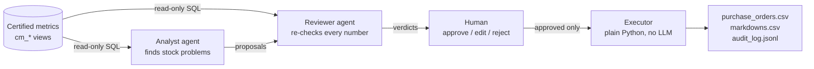

# Retail Agents — a two-agent pilot with human-in-the-loop

A small, working pilot of **agentic AI for retail decisions**:
two Gemini agents cooperate on certified retail metrics, and **nothing is executed until a human approves it**.



## What it does

Every morning a retail chain (3 stores, 12 products, 8 weeks of sales) wants to know:
*which products will run out before the supplier can deliver, and which are sleeping on the shelves?*

1. **Analyst agent** reads the certified metrics, spots stockout risks (`days_of_cover < lead_time_days`) and overstock (`days_of_cover > 90`), and submits proposals: *reorder N units* or *mark down X %*, each with its SQL evidence.
2. **Reviewer agent** gets those proposals and **re-queries the data itself**. It checks the arithmetic and the business sense, then says *agree*, *disagree*, or *adjust* (with a corrected value).
3. **The human** sees both opinions side by side and approves, edits, or rejects each one.
4. A **plain-Python executor** writes only the approved actions to `outbox/` and logs every decision to an append-only audit trail.

## Design choices (and why)

| Choice | Why |
|---|---|
| **Agents can only read `cm_*` certified views** — enforced in code (read-only connection + SQLite authorizer + query check), not just in the prompt | A prompt is a request; code is a guarantee. Same idea as BigQuery *authorized views*. |
| **No agent has an "execute" tool** | The only way to change the world is through the human gate. An LLM can't be talked into executing, because it physically can't. |
| **Reviewer re-checks every proposal with its own queries instead of trusting the Analyst** | A second pair of eyes on the reasoning. (It can't be trusted with arithmetic either, see below: that is done by code.) |
| **Order quantities are computed by code, not by the LLM** | In live runs the AI's numbers contradicted its own explanations. The LLM decides *whether* to act, code computes *how much*. |
| **A proposal the Reviewer skipped is flagged `NOT REVIEWED`** | Silence must never look like approval. |
| **Agent loop written from scratch (~60 lines), no framework** | Every step is visible and testable. The same concepts (tools, loop, shared state, HITL) map onto Agent Studio / ADK / LangGraph. |
| **Messy data on purpose** | The raw layer contains POS *test transactions* and a one-day promo spike. The certified layer cleans them, so agents don't over-order based on fake demand. |

## Run it

```bash
pip install -r requirements.txt
python data/seed.py                       # builds data/retail.db
export GEMINI_API_KEY=...                 # free key: https://aistudio.google.com/apikey
python main.py
```

On Windows, set the key with `set GEMINI_API_KEY=...` (cmd) or `$env:GEMINI_API_KEY="..."` (PowerShell).

Default model: `gemini-3.5-flash-lite` (free tier: 15 requests/min, 500/day), with automatic fallback to other Gemini models. Force one with `GEMINI_MODEL=...`.

## Tests (no API key needed)

```bash
python -m pytest -q
```

A scripted fake model plays both agents, so the plumbing is tested deterministically: governance rules, the agent loop, error handling (unknown tool, bad arguments, runaway loops), the full Analyst → Reviewer → Human → Executor path, the Gemini request format, and API failure handling (503 retries, quota pacing, model fallback).

## What worked, what failed

- WORKED: SQLite's authorizer correctly blocks direct reads of `raw_*` tables while allowing them *inside* certified views.
- FAIL: **Found a bypass:** `SELECT ... FROM cm_daily_sales JOIN raw_sales USING(store_id)` slipped through, because SQLite doesn't report the `USING` column of the right-hand table to the authorizer. **Fix:** a second guard that refuses any query naming a `raw_` table. Regression test included.
- FAIL: `COUNT(*)` on a simple view was wrongly blocked (SQLite reports a column-less read of the underlying table). **Fix:** allow reads that touch no column values.
- FAIL: **First live run crashed** on `503 UNAVAILABLE` ("model experiencing high demand"). A pilot can't die because the API had a busy minute. **Fix:** exponential backoff on 429/5xx errors, then automatic fallback to the next Gemini model, with a clean message if everything is down. Tests simulate the outage.
- FAIL: **Second live run hit the free-tier quota:** Flash models allow only 5 requests/min and 20/day, and an agent makes one request per step. **Fixes:** (1) default to Flash Lite (15/min, 500/day); (2) pace calls to stay under the per-minute limit instead of hitting it; (3) honour Google's "retry in Xs" hint; (4) skip straight to the next model on a daily-quota or 404 error; (5) prompt both agents to batch: one query for all rows, all tool calls in one turn. Fewer steps = cheaper and faster.
- FAIL: **The Reviewer contradicted itself.** In a live run its explanation said *"ceil(26.89 × 18 − 30) = 455"*, but the number it actually submitted was **472**, while the Analyst had proposed 407. Two AIs, three different numbers, and the right one only appeared in free text. **Fix:** arithmetic moved out of the LLM entirely. A `reorder_quantity` tool computes the official formula in code; every reorder proposal carries the code's value, the human screen shows it next to the AI numbers with a ⚠️ when they differ, and approval defaults to the code's value. Lesson: **let the LLM decide *whether* to act; let code compute *how much*.**
- FAIL: **The Analyst misses things, and the Reviewer can't see what was never proposed.** The data contains 6 real problems (4 stockout risks, 2 overstocks). The Analyst found 4/6 in the first complete run and 5/6 in the latest one; in both runs it missed `SKU-301 @ PAR01` (19.4 days of cover vs a 21-day lead time). In the first run it even wrote that 19.4 and 16.7 were "not strictly less than" 21 and 18, which is false. The Reviewer only checks proposals it is handed, so an omission passes silently. **Next fix:** a deterministic coverage check in code (run the stockout/overstock rules in SQL, compare with the proposals, show any missing item to the human).

## Live run results (Gemini 3.5 Flash Lite, free tier)

| Run | Problems found | Number problems | Human actions |
|---|---|---|---|
| Before the fix | 4 / 6 | Reviewer's text said 455 but it submitted 472; for another item its text said 163 but it submitted 115 | Human overrode the AI numbers by hand (455, 163) |
| After the fix (code-computed quantities) | 5 / 6 | None: Analyst, Reviewer and the code all gave 455 / 163 / 67 | 5 of 5 approved, audit log and outbox files written |

The audit trail (`outbox/audit_log.jsonl`) records for each proposal what the Analyst proposed, what the Reviewer said, what the human decided and when. Nothing reached `purchase_orders.csv` or `markdowns.csv` without a human approval.

## Project layout

```
data/seed.py          builds the database: raw layer + certified cm_* views + metric dictionary
pilot/tools.py        the tools agents can call, and the governance guardrails
pilot/agent.py        the agent loop + Gemini adapter
pilot/team.py         the two agents' instructions and how they hand off work
pilot/human_gate.py   human approval, executor, audit log
main.py               runs everything
tests/                offline tests with a scripted model
```

## Next steps

- Coverage check in code so a missed problem is surfaced to the human (see "what failed").
- Swap SQLite for BigQuery (`google-cloud-bigquery`, same certified views as authorized views).
- Evaluation set: plant N known problems, measure recall/precision of the Analyst and how often the Reviewer catches injected errors.
- Rebuild the same two agents in Google Agent Studio and compare reliability against this code version.
